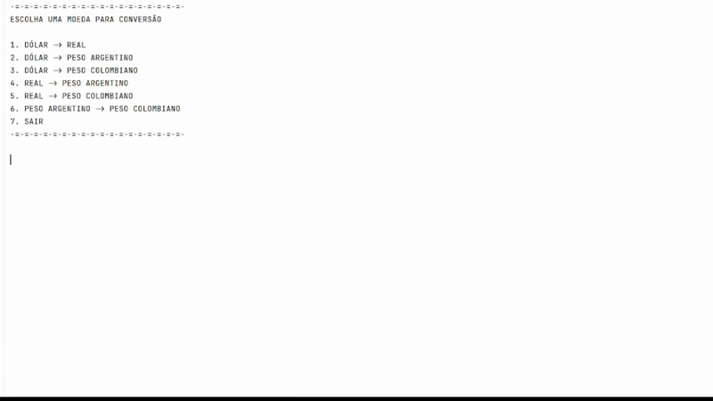

# Conversor de Moedas 🏦💱

Projeto desenvolvido como parte do desafio Java da Alura One: construir um conversor de moedas que consome taxas de uma API de câmbio.

## 🎯 Visão Geral  
Este aplicativo de console permite ao usuário escolher entre diferentes pares de moedas, informar um valor e obter o valor convertido conforme a cotação atual. Ideal para quem está comprando em sites internacionais, viajando ou estudando integração com APIs externas.

## ✅ Funcionalidades  
- Menu interativo via console com 6 opções de conversão (origem → destino).  
- Leitura da opção do usuário + valor a converter.  
- Conexão com uma API de câmbio para buscar a taxa mais recente.  
- Conversão do valor e exibição no console.  

## 🧰 Tecnologias e Ferramentas  
- Java 21  
- Maven para gerenciamento de dependências  
- GSON para manipulação de JSON da API  
- API de câmbio ExchangeRate-API  

## ▶️ Como executar localmente  
1. Clone o repositório:  
   ```bash
   git clone https://github.com/Gperaa/challenge-conversor.git
   cd challenge-conversor
## Demonstração


